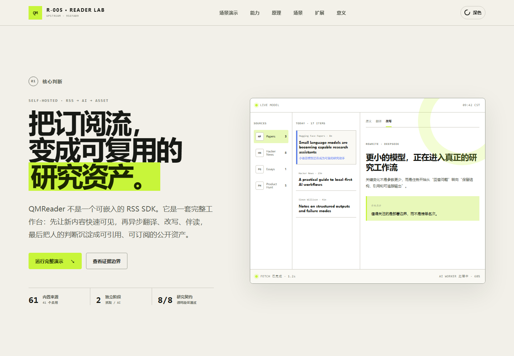
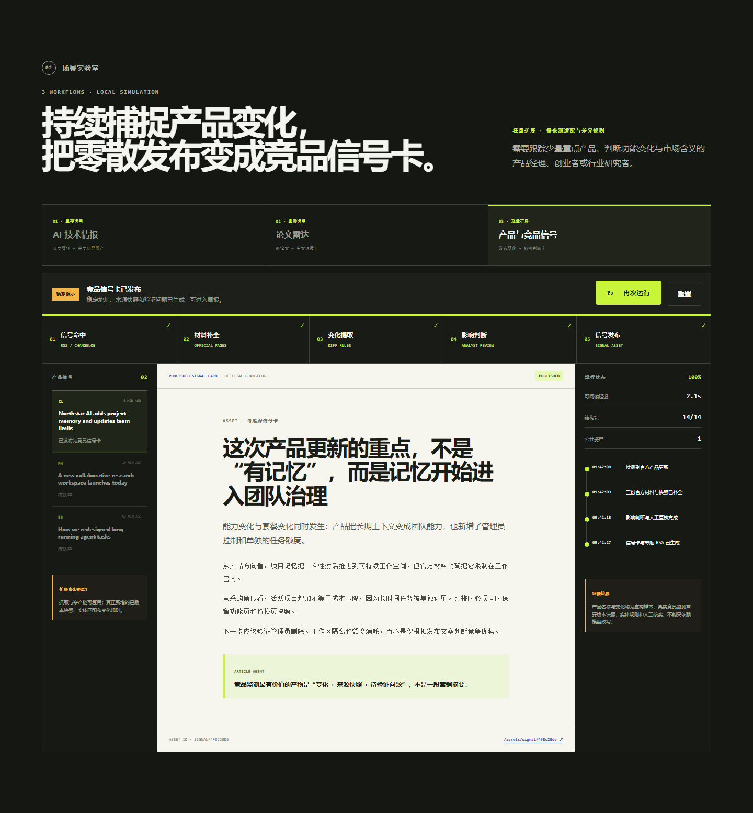
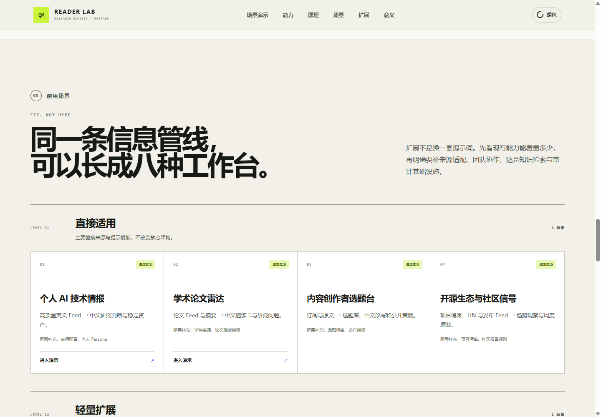

# R-005 · QMReader 能力与架构研究

> 研究 QMReader 如何把多源信息采集、AI 辅助阅读和公开知识资产沉淀连接成一个自托管工作流，并判断哪些设计值得复用。

| 字段 | 内容 |
| --- | --- |
| 研究编号 | R-005（当前研究索引第 5 项；编号不随排序变化） |
| 状态 | 进行中 |
| 研究对象 | [joeseesun/qmreader @ `95efab9`](https://github.com/joeseesun/qmreader/tree/95efab925273924963d2fdb474a67890261402e3) |
| 锁定版本 | [`95efab925273924963d2fdb474a67890261402e3`](https://github.com/joeseesun/qmreader/commit/95efab925273924963d2fdb474a67890261402e3) |
| 上游版本字段 | `package.json` 为 `1.0.0`，该提交无对应 Git tag |
| GitHub 研究目录 | [yydshly/0830_1_codex_project · projects/qmreader-study](https://github.com/yydshly/0830_1_codex_project/tree/main/projects/qmreader-study) |
| 在线研究页 | [R-005 · QMReader 能力与架构研究](https://yydshly.github.io/0830_1_codex_project/projects/qmreader-study/) |
| 在线交互展厅 | [能力、原理、八类场景、扩展与三套演示](https://yydshly.github.io/0830_1_codex_project/projects/qmreader-study/site/) |
| 开始日期 | 2026-08-30 |
| 最近更新 | 2026-08-31 |
| 负责人 | yydshly |

## 30 秒摘要

QMReader 不是供其他程序调用的通用 RSS 库，而是一套完整的、自托管的中文 RSS 阅读工作台。它的核心价值是把以下链路连接起来：

```text
RSS / RSSHub / Sitemap / 定制来源
                 ↓
       抓取、补全、清洗、去重
                 ↓
      新条目先落盘并立即可阅读
                 ↓
     AI 标题翻译、正文翻译、改写
                 ↓
    批注、点评、对话、贡献与反馈
                 ↓
       稳定链接、RSS、Sitemap
```

它适合作为个人或小团队的“信息加工厂”，也适合作为 AI 阅读产品的参考实现；目前不宜直接视为高并发多租户平台、严谨研究型 RAG 系统或可嵌入其他项目的 SDK。

## 交互研究网页

[在线打开 R-005 交互研究展厅](https://yydshly.github.io/0830_1_codex_project/projects/qmreader-study/site/)（[仓库内入口](site/)）可以沿“能力 → 原理 → 场景 → 扩展 → 对我们的意义”阅读本研究。默认场景是最适合 QMReader 的个人 AI 技术情报工作台；还可以切换论文雷达和产品与竞品信号，观察同一条五阶段管线如何生成不同资产。

在仓库根目录运行：

```powershell
node .\projects\qmreader-study\site\server.mjs
```

然后访问 `http://127.0.0.1:4217/`。三套演示分别呈现资讯加工、论文速读和产品变化判断；每套都覆盖命中、补全、结构处理、人工判断和资产发布，并支持切换、暂停、继续、重置、深浅主题和减弱动效。它们是基于源码研究结论制作的受控模拟，不会调用真实 RSS 或模型 API。







实现入口见 [`site/index.html`](site/index.html)，设计与覆盖清单见 [`site/DELIVERY.md`](site/DELIVERY.md)，真实浏览器验收见 [`site/browser-evidence.md`](site/browser-evidence.md)。

## 研究问题

1. QMReader 实际覆盖了哪些采集、阅读、AI 加工和知识沉淀能力？
2. 它如何避免慢速 AI 任务阻塞 RSS 内容更新？
3. 翻译、改写和文章问答分别采用了什么上下文与质量控制机制？
4. 哪些能力由源码和自动化测试支持，哪些只是产品层面的声明？
5. 作为个人工具、小团队工具或公共服务时，它的适用边界分别是什么？
6. 哪些架构模式值得在本研究仓库后续项目中复用？

## 范围

### 包含

- 固定上游提交的源码结构与许可证核对。
- 信息源、抓取、存储、刷新调度、AI 加工、阅读交互和公开资产能力梳理。
- 上游测试、语法检查和依赖审计的本地基线验证。
- 架构优点、限制、适用场景及可扩展方向分析。

### 不包含

- 使用真实 API Key 对 DeepSeek 或其他付费模型做质量与成本评测。
- 对生产站点实施压力测试、安全攻击或大规模抓取。
- 修改上游源码或将 QMReader 直接产品化。
- 对公开转载、翻译和改写内容给出法律结论。

## 能力地图

| 能力域 | 已实现能力 | 主要证据 |
| --- | --- | --- |
| 信息采集 | 直接 RSS/Atom、RSSHub 候选实例、Sitemap、WordPress JSON、手工投稿 | `lib/sources.js`、`lib/fetcher.js` |
| 定制增强 | Hacker News 多 Feed 合并、讨论与作者回复；Product Hunt 官网材料；论文条目格式化 | `lib/fetcher.js` |
| 内容处理 | 编码识别、正文补抓、HTML 清洗、链接绝对化、条目去重、缓存合并 | `lib/fetcher.js` |
| 阅读工作台 | 来源筛选、搜索、最新/热门/未读、收藏、历史、原文与加工结果切换 | `public/index.html`、`public/app.js` |
| AI 标题翻译 | 英文标题识别、批处理、结构化 JSON 返回、缺失项重试 | `lib/deepseek.js` |
| AI 正文翻译 | HTML 结构分块、分批翻译、覆盖率检查、标签与资源保真检查 | `lib/deepseek.js` |
| AI 改写 | 普通文章、论文、HN、Product Hunt 使用不同材料组织与提示模板 | `lib/deepseek.js` |
| Article Agent | 当前文章上下文问答、最近对话历史、流式与非流式接口 | `lib/deepseek.js`、`server.js` |
| 阅读资产 | 翻译、改写、点评、划线、对话、贡献者页、反馈、通知 | `lib/store.js`、`server.js` |
| 公开分发 | 资产深链、分类 RSS、贡献者 RSS、Sitemap、`llms.txt` | `server.js` |
| 账号与管理 | 注册登录、会话、角色、投稿隔离审核、用户封禁与恢复 | `lib/store.js`、`server.js` |
| 自托管 | Express 静态站点、SQLite、Docker Compose、systemd | `server.js`、`Dockerfile`、`docker-compose.yml` |

## 实现原理

### 1. 来源注册与候选回退

信息源集中定义在 `lib/sources.js`。一个来源可以配置多个候选地址；抓取器依次尝试直接 Feed、`{rsshub}` 路由、`sitemap:` 或 `wpjson:`。来源还可以声明刷新周期、优先级、成本、最大条目数和是否启用。

当前设计便于维护作者自己的固定来源，但不是多用户动态订阅模型：普通用户可以提交单条链接，不能通过产品界面管理完整的个人 Feed 集合。

### 2. 抓取、标准化与安全边界

`lib/fetcher.js` 负责解析 Feed、抽取正文、统一字段、去重并写入缓存和 SQLite。对外部 URL 的访问会限制协议、端口和响应体大小，拒绝本机及私有地址；DNS 解析通过后会固定已校验地址，并在每次手工重定向时重新验证，降低 SSRF 和 DNS rebinding 风险。

抓取器还包含较多来源特化逻辑。这提升了默认信息源的内容质量，但也让新增特殊来源需要修改核心文件。

### 3. 快抓取与慢 AI 分离

Web 进程分别派生 fetch worker 和 AI worker：

1. fetch worker 抓取并落盘后立刻通过 IPC 通知 Web 进程重新载入；
2. Web 进程只把发生变化的来源加入 AI 队列；
3. AI worker 补标题翻译和自动改写；
4. 同一时间到来的 AI 请求按来源 ID 合并，当前任务结束后继续处理。

定时刷新不是简单轮询全部来源，而是根据过期比例、来源优先级、长期饥饿补偿和抓取成本评分，从候选中选择一个有批量与成本上限的集合。

### 4. AI 加工与缓存失效

- 标题翻译要求模型返回固定 JSON，并校验 ID、中文字符和重复项。
- 正文翻译先把 HTML 转成结构块，再按上下文预算分批翻译；漏块会定向重试，仍不完整时拒绝保存。
- 翻译结果会校验链接、图片、标签顺序和最低文本覆盖率。
- 改写根据内容类型选择不同提示模板，输入最多取约 14,000 字符，并进行长度与段落覆盖检查。
- 翻译和改写都记录内容 hash；原文变化时旧结果不会被当作有效缓存继续使用。

服务端默认使用 DeepSeek，也支持 OpenAI-compatible 与 Anthropic-compatible 请求。用户自带的 API Key 保存在浏览器 `localStorage`，调用时仍会随请求经过 QMReader 后端代理。

### 5. Article Agent 的真实边界

Article Agent 会将标题、来源、时间、摘要和最多约 8,000 字符的正文片段作为上下文，并携带最近 12 条对话消息调用模型。

锁定版本中没有 embedding、向量索引、语义召回或跨文章知识检索。因此它是“单篇文章上下文对话”，不是 RAG 知识库。长文章后半部分可能不在问答上下文内。

### 6. 数据与公开资产

运行数据主要保存在 SQLite；抓取层另有 `data/cache.json`。数据表覆盖条目、翻译、改写、AI 资产贡献、评论、批注与回复、聊天、用户、关注、通知、反应、阅读状态、投稿和刷新任务。

系统进一步把公开内容映射为稳定页面、RSS 和 Sitemap，使一次阅读加工可以被搜索、引用和再次订阅。这是 QMReader 相对普通 RSS 阅读器最有辨识度的设计。

## 使用场景与采用判断

| 场景 | 改造等级 | 可复用基础 | 还需要补什么 |
| --- | --- | --- | --- |
| 个人 AI 技术情报 | 直接适用 | 多源采集、翻译、改写、点评、稳定资产 | 来源配置、个人 Persona |
| 学术论文雷达 | 直接适用 | 论文格式化、结构翻译、内容 hash、Article Agent | 学科来源、论文解读模板、真实术语与引用评测 |
| 内容创作者选题台 | 直接适用 | 订阅、中文改写、批注和公开资产 | 选题标签、发布模板、版权策略 |
| 开源生态与社区信号 | 直接适用 | HN 增强、项目博客 Feed、刷新调度 | 项目清单、社区权重与去重规则 |
| 产品与竞品信号 | 轻量扩展 | RSS/Sitemap、Product Hunt、正文补全、资产发布 | source adapter、版本快照、实体与差异规则 |
| 团队周报与公开策展 | 轻量扩展 | 用户、贡献者、评论、通知和资产 RSS | 团队空间、审批、细粒度权限、邮件验证 |
| 企业内部知识空间 | 深度改造 | “输入 → 加工 → 资产”的方法 | 多租户、PostgreSQL、持久队列、检索、权限和审计 |
| 政策与合规监测 | 深度改造 | Sitemap、定时抓取、内容 hash 和公开链接 | 逐段引用、版本留存、人工复核、告警 SLA |

通用 RSS 服务、严谨研究型 RAG 和 npm SDK 仍不是锁定版本的直接定位：它缺少完整的用户订阅体系、跨文章检索与稳定库级 API。

## 值得复用的设计

1. **先快后慢：** 内容可见性不依赖 AI 完成。
2. **内容 hash 驱动失效：** 避免原文变化后复用过期 AI 产物。
3. **结构化翻译与拒绝不完整结果：** 对长文处理比一次性自由文本提示更可靠。
4. **出站请求安全验证：** 对用户提交 URL 的风险处理比普通个人项目完整。
5. **将 AI 输出建模为资产：** 输出具有作者、模型、来源、反馈和稳定地址，而不是一次性聊天文本。
6. **按来源新鲜度与成本调度：** 可以推广到抓取、索引和模型预算管理。

## 已知限制与风险

- `public/app.js`、`server.js`、`lib/store.js` 和 `lib/fetcher.js` 都是大型单文件，继续扩展会提高修改与回归风险。
- 来源注册、特殊抓取和部分人物化提示词与作者个人工作流耦合较深。
- SQLite 与本地 JSON 缓存适合单机，但增加了多进程一致性与资源释放问题。
- Dockerfile 使用 Node 26，源码依赖 `node:sqlite`，但 `package.json` 没有声明 `engines`，本地部署者容易选错 Node 版本。
- 当前注册只检查邮箱格式和密码长度，没有邮件验证；不宜无修改地开放为大型公共社区。
- BYOK 密钥虽然不入 SQLite，但保存在浏览器长期存储并经过服务端代理，仍需要评估浏览器环境和服务端日志边界。
- 公开翻译、改写和正文资产的发布需由部署者另行核对原内容许可与发布策略。
- 锁定版本的依赖审计存在已知告警，详见[基线验证](artifacts/baseline-verification.md)。

## 可扩展方向

### P0：先补工程与安全基线

- 升级存在审计告警的依赖并回归测试。
- 明确 Node `engines` 和受支持平台，修复 Windows 下 SQLite 测试资源释放。
- 将大型文件按路由、领域存储、抓取适配器和前端视图拆分。
- 为关键路径增加集成测试、端到端测试和真实迁移测试。

### P1：从个人工具变成可配置产品

- 支持 OPML 导入导出、用户自定义 Feed、标签和过滤规则。
- 把来源特化逻辑抽象为 source adapter/plugin。
- 把“乔木风格”抽象为可版本化、可评测的提示模板与 persona。
- 增加私有资产、团队空间、细粒度权限和邮件验证。

### P2：从单篇伴读变成知识系统

- 对文章进行稳定分块、embedding 和跨文章检索。
- 回答附带原文段落定位、引用和不确定性说明。
- 建立实体、主题和观点之间的关联，支持专题综述。
- 增加事实核验、来源质量和重复观点检测。

### P3：规模化与生态化

- 使用持久化任务队列、PostgreSQL 和对象存储。
- 增加模型路由、重试、幂等、限额、成本和质量观测。
- 提供 Webhook、导出 API、浏览器扩展和移动端离线阅读。

## 验证标准

| 编号 | 假设或能力 | 验证方法 | 通过标准 |
| --- | --- | --- | --- |
| H1 | 上游源码与许可证可被精确复现 | 获取脚本与 Git 检查 | HEAD 等于锁定 SHA，许可证为 MIT |
| H2 | 支持多种来源接入 | 静态契约测试与源码检查 | RSS、RSSHub、Sitemap、WP JSON 路径均存在 |
| H3 | 抓取和 AI 是独立后台阶段 | 静态契约测试与源码检查 | 存在独立 fetch/AI worker 及变化来源队列 |
| H4 | 翻译具备结构和覆盖率保护 | 上游测试与静态契约测试 | 分块、资源保真、覆盖率与缓存 hash 逻辑存在且相关测试通过 |
| H5 | Article Agent 仅为单篇上下文问答 | 静态检查 | 存在固定上下文截断，未发现向量检索实现 |
| H6 | 阅读结果被持久化并公开分发 | Schema 与路由检查 | 资产表、贡献表及公开 RSS/Sitemap 路由存在 |

## 实验矩阵

| 实验 | 变量 | 对照 | 证据位置 | 结果 |
| --- | --- | --- | --- | --- |
| E1 上游身份与结构检查 | 锁定提交源码 | 上游 README 声明 | `tests/capability-contract.test.mjs` | 已通过 |
| E2 上游自动化测试 | Node 22 / Windows | 上游测试预期 | `artifacts/baseline-verification.md` | 部分通过，发现清理失败 |
| E3 JavaScript 语法检查 | 核心服务与前端文件 | 无 | `artifacts/baseline-verification.md` | 已通过 |
| E4 依赖安全基线 | 锁定 `package-lock.json` | `npm audit` | `artifacts/baseline-verification.md` | 发现 3 个告警 |
| E5 AI 输出质量与成本 | 待使用固定样本和模型 | 待定义 | 待补充 | 未执行 |

## 获取与复现

环境基线：Windows 11、PowerShell 7、Git、Node.js 22.15.0、npm 10.x。上游 Dockerfile 当前使用 Node 26。

在仓库根目录执行：

```powershell
powershell -ExecutionPolicy Bypass -File .\projects\qmreader-study\scripts\fetch-upstream.ps1
node --test .\projects\qmreader-study\tests\capability-contract.test.mjs

Push-Location .\projects\qmreader-study\upstream\qmreader
npm ci
npm test
Pop-Location
```

获取脚本会把锁定提交检出到 `upstream/qmreader`。该目录用于本地实验并被本项目 `.gitignore` 排除，不会把完整第三方仓库复制进主仓库。

更多原始观察见 [research-log.md](research-log.md)，首轮验证结果见 [artifacts/baseline-verification.md](artifacts/baseline-verification.md)。

## 后续问题

- 在固定 20 篇英文长文上，结构化翻译相对整篇翻译的遗漏率、HTML 保真度和成本如何？
- “先抓取后 AI”相对同步处理能将新内容可见时间降低多少？
- 内容 hash 能否覆盖所有影响翻译与改写的输入变化？
- 当来源增长到 500 或 5,000 个时，SQLite、JSON 缓存和子进程队列的瓶颈在哪里？
- 公开阅读资产是否真的提高检索和复用率，还是只增加内容副本？

## 来源与许可证

- 上游仓库：[joeseesun/qmreader](https://github.com/joeseesun/qmreader)
- 锁定提交：[`95efab925273924963d2fdb474a67890261402e3`](https://github.com/joeseesun/qmreader/commit/95efab925273924963d2fdb474a67890261402e3)
- 上游许可证：[MIT License](https://github.com/joeseesun/qmreader/blob/95efab925273924963d2fdb474a67890261402e3/LICENSE)，Copyright (c) 2026 向阳乔木。
- 本研究项目只提交原创分析、获取脚本和验证代码；上游源码保持其原许可证，不因被研究而改变授权关系。
