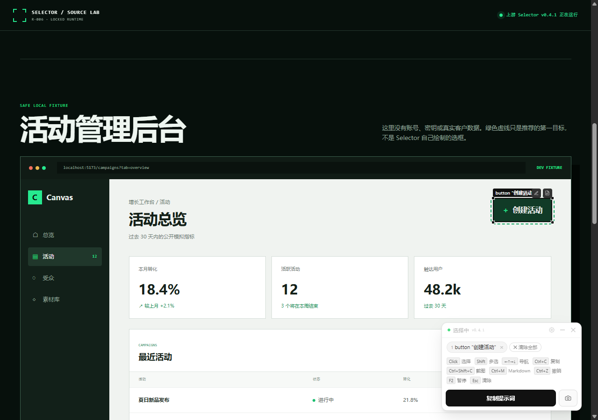

# R-006 · Selector 能力研究（第 6 个研究子项目）

> 基于固定源码版本，验证 Selector 如何把网页视觉指代转换为 AI 可执行上下文，以及这种上下文对前端修改工作流的实际价值和边界。

| 字段 | 内容 |
| --- | --- |
| 研究编号 | `R-006` · 第 6 个研究子项目 |
| 状态 | 进行中；固定源码构建、静态能力和真实 Light DOM 运行示例已验证 |
| 研究对象 | [oil-oil/selector](https://github.com/oil-oil/selector) |
| 上游版本 | 0.4.1 |
| 锁定提交 | [`d88e9a6c3c10821a5cc6d87447693d9507a76b35`](https://github.com/oil-oil/selector/commit/d88e9a6c3c10821a5cc6d87447693d9507a76b35) |
| 在线研究页 | [GitHub Pages / R-006](https://yydshly.github.io/0830_1_codex_project/projects/selector-study/) |
| 在线 Web 展厅 | [能力整理、场景模拟、决策台与源库实跑](https://yydshly.github.io/0830_1_codex_project/projects/selector-study/showcase/) |
| 源库实跑直达 | [Selector v0.4.1 安全 fixture](https://yydshly.github.io/0830_1_codex_project/projects/selector-study/showcase/source-demo/) |
| 发布状态 | GitHub Pages 已上线；HTML 入口、锁定运行时哈希与线上真实选择主流程均已验证 |
| 开始日期 | 2026-08-30 |
| 最近更新 | 2026-08-31 |
| 负责人 | yydshly |

## 30 秒摘要

- **能力：** 在网页上点击、Shift 多选或框选元素，输出稳定 selector、语义 locator、必要的 HTML/样式、React/Vue 调试线索；Sharingan 再补 DOM、CSSOM、几何、字体、动画和媒体。
- **原理：** 书签把完整 CSS 与 JavaScript 注入当前页面，选择层给 Light DOM 写临时 ID，上下文编译器从 DOM、CSSOM、可访问性和框架私有运行时提取证据。
- **最合适的场景：** 本地开发页面中，产品或设计人员指着具体 UI，把“改这个”交给 Codex、Claude Code 或 Cursor；收益来自减少目标歧义，不是自动改代码。
- **不适合：** 批量爬取、CI 自动化、Shadow DOM/跨域 iframe 深层选择、含敏感数据的生产页面，以及源码位置已经明确的机械改造。
- **对我们的意义：** 它可以成为“人类视觉意图 → Agent 可审查任务包”的前置协议层；值得吸收的是证据编译和风险闸门，不是照搬一个选框 UI。
- **证据入口：** [上游锁定源码](https://github.com/oil-oil/selector/tree/d88e9a6c3c10821a5cc6d87447693d9507a76b35) · [在线 Web 展厅](https://yydshly.github.io/0830_1_codex_project/projects/selector-study/showcase/) · [真实源库运行示例](https://yydshly.github.io/0830_1_codex_project/projects/selector-study/showcase/source-demo/)

## 当前结论

Selector 是运行在当前网页中的视觉元素选择器和上下文编译器，不是 UI 组件库、爬虫或自动改代码的 Agent。它将点击、多选或框选得到的元素转换为包含稳定 CSS selector、语义 locator、页面位置、React/Vue 调试信息和必要样式的紧凑提示；Sharingan 模式进一步输出 DOM、CSSOM、几何、运行时状态、字体、动画和媒体证据。

固定版本的源码构建和静态能力检查已经通过；本项目还完成了一个零依赖交互式研究展厅，并在桌面、平板、手机、明暗主题、键盘和 reduced-motion 状态下完成浏览器验收。展厅现在包含两种证据层：研究页模拟负责解释多场景交付物和决策逻辑；源库实跑页直接加载由锁定提交构建且逐字节校验的上游 `editor.js` / `editor.css`，可在安全 Light DOM fixture 中真实完成启动、选取、备注和导出。它仍不等于跨浏览器兼容性、React/Vue 源码映射或 Agent 修改效果已经得到验证。

## 交互式研究展厅

[在线打开网页展厅：能力、原理、场景、扩展方向、采用意义、决策台与源库实跑 →](https://yydshly.github.io/0830_1_codex_project/projects/selector-study/showcase/)

[直接打开源库实跑：在安全后台 fixture 中运行 Selector v0.4.1 →](https://yydshly.github.io/0830_1_codex_project/projects/selector-study/showcase/source-demo/)

展厅保留“本地 React 活动后台的一次精确 UI 修改”作为最佳主流程：选择页面目标、填写修改指令、查看普通或 Sharingan 上下文，再模拟将证据交给 Codex。在此基础上，多场景实验台从六个工作角度继续演示不同交付物：

- 产品 / UI：精确修改任务 prompt；
- QA / 缺陷：包含瞬时状态和边界说明的 bug evidence brief；
- 设计 / 复刻：DOM、CSSOM、字体、动画与媒体组成的 Sharingan report；
- 内容 / 知识：保留层级、表格、链接和代码的 Markdown fragment；
- 工程 / 源码：开发态 React/Vue 组件链和 source trace；
- 测试 / 自动化：role、可访问名称和测试属性组成的 locator candidates。

每个场景同时给出适合度、信息成本、主要风险、下游动作、替代工具和“不该用”的条件。多场景输出与 Codex 修改结果明确标记为**研究页模拟**；紧接其后的“源库实跑”则加载锁定上游构建产物，真实呈现 Selector 的控制面板、选框、选择、备注与复制。两类演示都不会调用真实 Agent，因此不会把下游修改动画解释为效果实测。

源库实跑采用同源 iframe 隔离：读者可启动 Selector，点击带 `data-testid="create-campaign"` 的主操作，Shift 多选指标卡，添加 instruction，并用 Ctrl/⌘ + C 复制上游生成的 prompt；关闭面板后可在页面内粘贴核对。fixture 没有 React/Vue 私有运行时，因此有意不伪造组件链或 source 信息。



[查看这次真实运行生成的 259 字符、9 行 prompt →](artifacts/source-demo-runtime-prompt.md)

采用决策台进一步组合五个判断轴：任务、页面环境、数据敏感度、任务规模和保真要求。它可以路由到普通 Prompt、Sharingan、Markdown、Locator Prompt，也会在批量任务中建议换用 Playwright/CDP/crawler/codemod，在敏感生产页面中明确停止直接导出。分数是研究页根据能力边界计算的相对适合度，不是 Agent 成功率。

## 能力总览

| 能力 | 固定版本实现 | 主要输出 |
| --- | --- | --- |
| 视觉选取 | 点击、Shift 多选、框选、父子/兄弟导航、撤销、逐元素备注 | 一组带页面内临时 ID 的目标元素 |
| 紧凑上下文 | 稳定 selector、role/label locator、语义容器、必要的布局、HTML 和属性 | 可直接粘贴给 Codex 等 Agent 的提示文本 |
| 框架调试信息 | React Fiber、React 19 debug stack、Vue 2/3 组件标记 | 组件链、开发模式源码位置、受限 props/state 摘要 |
| Sharingan 报告 | DOM、几何、computed style、CSS 变量与规则、伪元素、状态、字体、动画、媒体 | 高保真复刻用 Markdown 报告 |
| 内容导出 | HTML 到 Markdown 的本地序列化 | 文本、列表、表格、链接、图片和代码块 |
| 截图 | 浏览器屏幕捕获后按选中元素几何裁剪 | PNG，或截图与文字组合的剪贴板内容 |
| SPA 适配 | MutationObserver 为新增 Light DOM 元素补充临时 ID | 路由切换和动态渲染后的继续选择 |

## 实现原理

### 1. 书签载荷

构建脚本把编辑器源码片段组装并进行语法解析检查，再将 JavaScript 以 Base64 文本输出到静态资源。安装页获取 CSS 与这些载荷，将其完整编码进 `javascript:` 书签。因此书签安装后不需要在目标页面远程加载脚本。

### 2. 页面内选择层

编辑器启动后遍历当前 Light DOM，为元素添加 `data-ai-id`，并在 document capture 阶段监听鼠标和键盘事件。命中测试结合 `elementsFromPoint()`、可见性、直接文本、交互标签和子元素数量选择“有意义”的目标；覆盖层通过固定定位框标记 hover 和 selection。

### 3. 上下文编译

稳定 selector 依次偏好测试属性、稳定 ID、可访问属性和语义 class，并用 `querySelectorAll()` 验证唯一性。语义 locator 使用显式或隐式 role 加可访问名称。React/Vue 信息来自页面运行时私有调试字段，因此开发构建比生产构建更容易得到组件和源码位置。

### 4. 高保真报告和截图

Sharingan 同步读取 DOM、CSSOM、computed style、CSS 自定义属性、伪元素、交互态规则、祖先样式、字体、关键帧和框架状态，并对常见 token 名称和值做启发式脱敏。免费书签版截图通过 `getDisplayMedia()` 获取画面，再按元素矩形与设备像素比裁剪。

## 研究问题

1. 固定版本实际采集哪些上下文字段，各字段来自 DOM、CSSOM、可访问性还是框架私有运行时？
2. 普通提示与 Sharingan 报告在信息完整度、token 体积和生成耗时上有何差异？
3. 相比纯文字、单张截图和 DevTools selector，Selector 是否提高 Codex 定位目标和修改正确率？
4. React/Vue 开发与生产构建、SPA、Shadow DOM、iframe、Canvas/WebGL 页面上的能力边界是什么？
5. 报告脱敏和页面注入是否足以满足本地开发与已登录页面的安全要求？

## 范围

### 包含

- 固定并获取 Selector 开源书签版源码；
- 验证构建、核心选择、上下文、导出和 Sharingan 代码契约；
- 提交锁定构建中的 `editor.js` / `editor.css` 作为可运行研究 fixture，并记录来源与 SHA-256；
- 建立能力、实现和边界的证据映射；
- 设计后续浏览器兼容性、上下文质量和 Agent 修改对照实验；
- 记录上游版本、获取方法和许可证现状。

### 不包含

- 本轮不修改 Selector 上游源码；
- 不研究未开源的 Selector Pro 扩展实现；
- 不把完整第三方仓库、依赖缓存或安装站点提交到本研究仓库；仅保留真实运行示例必需、逐字节锁定的两个编辑器构建产物；
- 不在包含账号、个人信息或密钥的生产页面直接采集 Sharingan 报告；
- 不把静态源码检查解释为浏览器兼容性或 AI 修改效果已经得到验证。

## 背景与基线

前端协作的常见基线是文字描述“修改右上角按钮”、附一张截图，或手工从 DevTools 复制 CSS selector。这些方式分别缺少可验证的元素身份、结构和视觉状态，且很难同时关联到框架组件和源码位置。

本研究以三种输入作为对照：纯自然语言、截图加自然语言、DevTools selector 加自然语言。Selector 实验组分别使用普通提示和 Sharingan 报告，并保持目标页面、任务、Agent、模型设置和代码基线一致。

## 验证标准

| 编号 | 假设或能力 | 验证方法 | 通过标准 |
| --- | --- | --- | --- |
| H1 | 上游身份和构建可精确复现 | 获取脚本、Git HEAD、package 及上游构建 | HEAD 和版本匹配；`npm run check` 通过 |
| H2 | 普通模式生成稳定且紧凑的元素身份 | 静态契约测试和浏览器 fixture | 优先使用强标识并验证唯一性；输出包含语义 locator |
| H3 | Sharingan 覆盖高保真复刻所需的主要证据 | 静态契约测试和固定页面采集 | DOM、几何、样式、规则、状态、字体、动画、媒体均有报告入口 |
| H4 | 结构化上下文提高 Agent 修改正确率 | 固定任务的多组盲测 | 首次修改正确率高于纯文字和截图基线，并报告 token/耗时 |
| H5 | 脱敏不会把敏感报告误判为安全 | 含模拟凭据与 PII 的离线 fixture | 预定义敏感字段全部遮蔽；记录漏报和误报 |
| H6 | 浏览器和 DOM 边界被准确描述 | Chrome/Edge/Firefox、Shadow DOM、iframe fixture | 每种环境都有可重复结果，不将不支持场景标记为已支持 |

## 实验矩阵

| 实验 | 变量 | 对照 | 证据位置 | 结果 |
| --- | --- | --- | --- | --- |
| E1 上游获取与身份检查 | 固定 commit | 远程 main 浮动版本 | `scripts/fetch-upstream.ps1`、`tests/verify-capabilities.mjs` | 已通过 |
| E2 上游构建与静态能力核验 | Node 22 / Windows | README 能力声明 | `artifacts/baseline-verification.md` | 已通过 |
| E2b 锁定源库运行示例 | 上游 `editor.js` / `editor.css`、安全 Light DOM fixture | 研究页机制模拟 | `showcase/source-demo/`、`tests/verify-source-demo.mjs` | 已通过构建身份、哈希与真实浏览器主流程 |
| E3 浏览器兼容性 fixture | 浏览器、页面结构、框架模式 | 普通 Light DOM 页面 | 待补充浏览器日志和截图 | 未执行 |
| E4 Agent 修改质量对照 | 文字、截图、selector、普通提示、Sharingan | 相同任务与代码提交 | 待补充结构化结果 | 未执行 |
| E5 隐私与侵入性检查 | 模拟 token、表单、props/state、页面监听器 | 无 Selector 页面 | 待补充测试和报告 | 未执行 |

## 获取与复现

要求：Git、PowerShell、Node.js 22 和 npm 10。在仓库根目录执行：

```powershell
powershell -ExecutionPolicy Bypass -File .\projects\selector-study\scripts\fetch-upstream.ps1
node .\projects\selector-study\tests\verify-capabilities.mjs
node .\projects\selector-study\tests\verify-showcase.mjs
node .\projects\selector-study\tests\verify-source-demo.mjs

powershell -ExecutionPolicy Bypass -File .\projects\selector-study\scripts\serve-showcase.ps1
# 浏览器打开 http://127.0.0.1:4186/

Push-Location .\projects\selector-study\upstream\selector
npm ci
npm run check
Pop-Location
```

获取脚本只检出锁定提交，并把本地工作副本放到忽略目录 `upstream/selector`。验证脚本检查 Git 身份、版本、构建契约、主要能力入口以及已知的 Light DOM、跨域和许可证边界。

## 结果与证据

- [基线验证记录](artifacts/baseline-verification.md)：环境、执行命令、原始结果和成熟度观察；
- [能力证据清单](artifacts/capability-evidence.md)：能力到固定源码位置的映射；
- [`verify-capabilities.mjs`](tests/verify-capabilities.mjs)：可重复的源码结构与边界检查；
- [交互式研究展厅](showcase/)：完整网页叙事与最佳场景演示；
- [锁定源库真实运行示例](showcase/source-demo/)：在安全 fixture 中直接加载上游 v0.4.1；[来源与哈希清单](showcase/source-demo/runtime/UPSTREAM.md)；
- [前端设计契约](docs/frontend-design-contract.md)、[覆盖清单](docs/frontend-coverage.md)、[浏览器验收](docs/frontend-validation.md)和[交接记录](docs/frontend-handoff.md)；
- [桌面](artifacts/showcase-desktop.png)、[平板暗色](artifacts/showcase-tablet.png)与[手机](artifacts/showcase-mobile.png)截图；
- [源库运行桌面证据](artifacts/source-demo-runtime.png)、[手机入口](artifacts/source-demo-mobile.png)、[主展厅嵌入区](artifacts/showcase-source-live.png)与[真实 prompt](artifacts/source-demo-runtime-prompt.md)；
- [`verify-showcase.mjs`](tests/verify-showcase.mjs)：内容覆盖、零外部运行时依赖、响应式、主题、键盘和 fallback 契约检查；
- [`verify-source-demo.mjs`](tests/verify-source-demo.mjs)：运行时 SHA-256、版本、关键入口、零外部依赖与本地上游逐字节一致性检查；
- [研究日志](research-log.md)：实验过程、判断和下一步；
- 本地上游副本：`upstream/selector`，HEAD 为锁定提交，不纳入版本控制。

## 结论

### 已证实

- Selector 是纯客户端书签式视觉选择和上下文编译工具；
- 普通模式具备选择、稳定 selector、语义 locator、React/Vue 调试信息和按需上下文输出；
- Sharingan 已实现面向 UI 复刻的多维报告；
- Markdown 和截图是独立导出路径；
- 固定版本没有 npm 运行时依赖，构建可在 Node.js 22 下完成。
- 已提交的真实运行示例与锁定上游构建逐字节一致，可在安全 Light DOM fixture 中启动并完成选择与导出主流程。

### 证据不足或未证实

- 尚未证明它能在主要浏览器、Shadow DOM 和 iframe 中一致工作；
- 尚未量化它对 Codex 修改正确率、token、时间和返工次数的影响；
- 源码脱敏是启发式规则，尚不能视为完整的数据防泄漏机制；
- React/Vue 私有调试字段在不同框架版本和生产构建中的稳定性尚未验证。

## 已知限制

- 当前元素遍历和框选主要覆盖 document Light DOM，没有通用的 Shadow DOM 递归；
- iframe 主要作为一个媒体元素报告，未实现通用的 frame 内部选择；
- 免费书签版无法读取跨域 stylesheet 文本，也无法可靠内联所有跨域图片和字体；
- React/Vue 源码与组件信息依赖非公开或开发模式运行时字段；
- 启动时会向大量元素写入 `data-ai-id` 并拦截页面事件，关闭工具不会清除所有属性，刷新页面最干净；
- 上游主分支的 `npm run check` 只执行构建，没有完整的浏览器自动化测试；
- README 声明 MIT，但锁定提交没有独立 `LICENSE` 文件，复用或再分发前需要保留来源并进一步确认许可证文本。

## 后续问题

- 创建最小 Light DOM、open Shadow DOM、同源/跨域 iframe 和 Canvas fixture；
- 记录 Chrome、Edge、Firefox 中书签启动、复制和截图的差异；
- 设计 10 个可判定的 UI 修改任务进行上下文方式对照；
- 测量普通与 Sharingan 报告的字符数、token、生成时延和 Agent 成功率；
- 为敏感字段建立红队 fixture，并评估导出前预览或白名单策略。

## 来源与许可证

- 上游源码：[oil-oil/selector](https://github.com/oil-oil/selector)，锁定提交 `d88e9a6c3c10821a5cc6d87447693d9507a76b35`；
- 上游包版本：`package.json` 声明 `0.4.1`；
- 上游 README 在锁定提交声明 `MIT`；锁定提交未包含独立 `LICENSE` 文件；
- 本研究没有复制完整上游仓库；完整源码通过固定提交获取脚本下载；
- 本研究为可重复在线演示保留了锁定构建中的 `editor.js` 与 `editor.css`；两者哈希和生成路径见 [`showcase/source-demo/runtime/UPSTREAM.md`](showcase/source-demo/runtime/UPSTREAM.md)，完整上游仍通过获取脚本下载；
- 目标网页的 HTML、图片、字体和其他素材仍分别受其权利人与来源条款约束。
